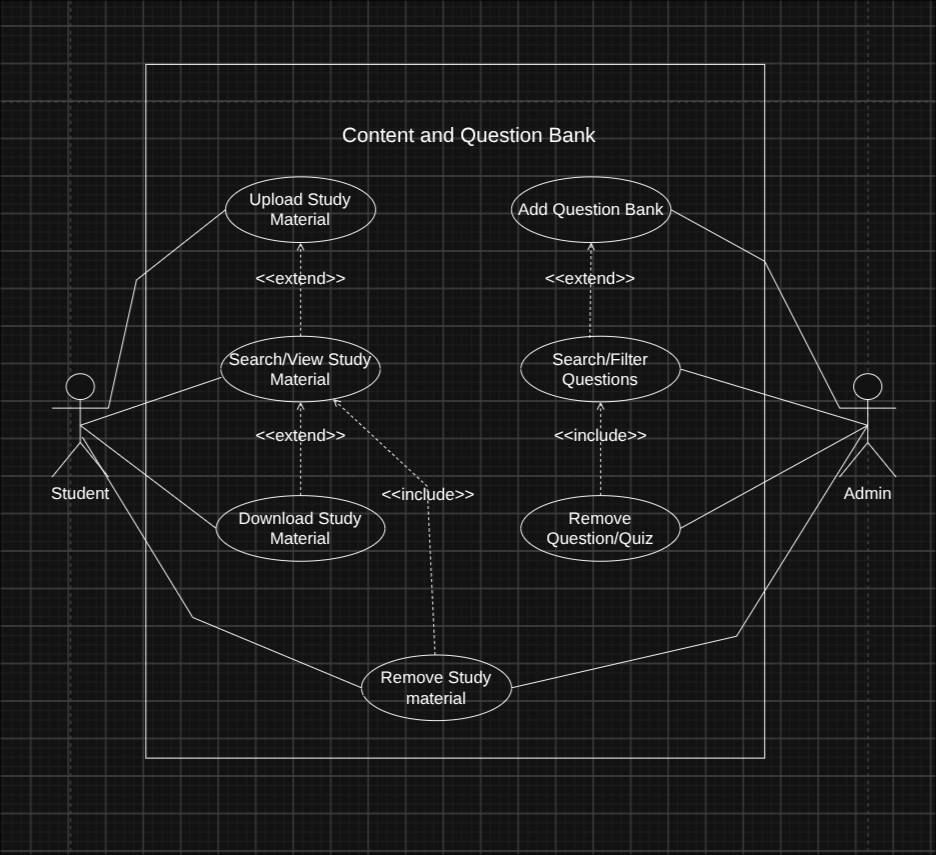
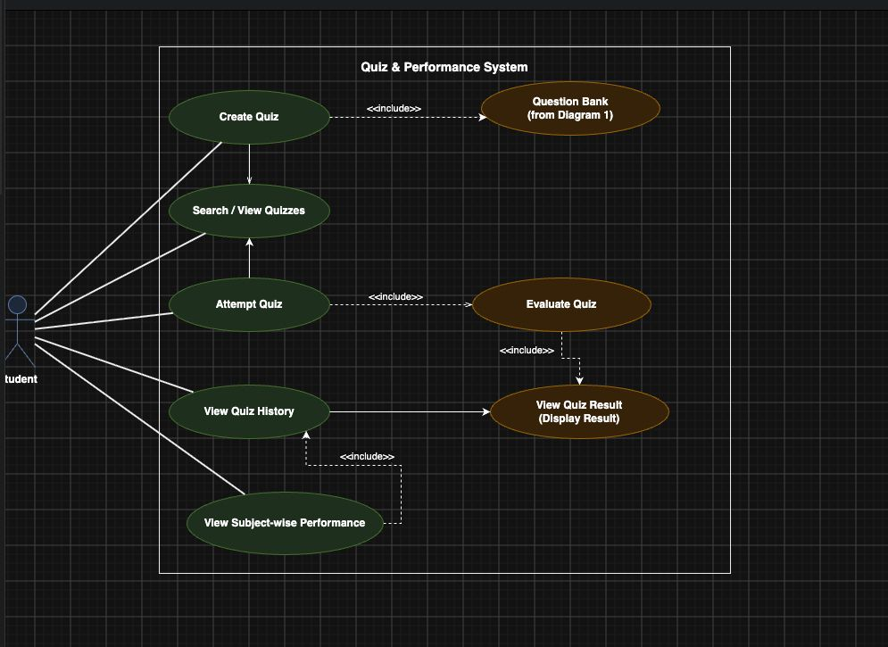

# Software Requirements Specification (SRS)

**Project:** Collaborative Study Material & Quiz Platform  
**Version:** 1.5 (Final)  
**Date:** 04-09-2026  
**Status:** Draft / Final Review  

## Authors

| Member | Name | USN |
|---|---|---|
| Member 1 | Dharani S | PES2UG24CS157 |
| Member 2 | Prajwal M | PES2UG24CS910 |
| Member 3 | Karan Varshney | PES2UG24CS903 |
| Member 4 | Harshit Chandak | PES2UG24CS185 |

---

## Revision History

| Version | Date | Author | Change Summary | Approval |
|---|---|---|---|---|
| 1.0 | 02-09-2026 | Team 10 | Initial SRS | Pending |
| 1.1 | 03-09-2026 | Team 10 | Scaled non-functional requirements for project-level verification | Pending |
| 1.2 | 04-09-2026 | Team 10 | Aligned student and administrator responsibilities and clarified question-bank permissions | Pending |
| 1.3 | 04-09-2026 | Team 10 | Added final work division and cross-testing plan | Pending |
| 1.4 | 04-09-2026 | Team 10 | Added UML diagrams and aligned diagram descriptions with the SRS | Pending |
| 1.5 | 04-09-2026 | Team 10 | Final consistency pass: corrected UML relationship semantics, removed ambiguous role wording, separated admin functions, clarified assumptions, acceptance criteria, and RTM | Pending |

---

## Approvals

| Role | Name | Signature / Email | Date |
|---|---|---|---|
| Course Coordinator | - | - | - |

---

## Table of Contents

1. [Introduction](#1-introduction)  
2. [Overall Description](#2-overall-description)  
3. [External Interface Requirements](#3-external-interface-requirements)  
4. [System Features](#4-system-features)  
5. [Non-Functional Requirements](#5-non-functional-requirements)  
6. [Security Requirements](#6-security-requirements)  
7. [Quality Attributes and Acceptance Tests](#7-quality-attributes-and-acceptance-tests)  
8. [System Models and UML Use-Case Diagrams](#8-system-models-and-uml-use-case-diagrams)  
9. [Work Division and Cross-Testing Plan](#9-work-division-and-cross-testing-plan)  
10. [Requirements Traceability Matrix](#10-requirements-traceability-matrix)  
11. [Assumptions and Out of Scope](#11-assumptions-and-out-of-scope)  
12. [Final Consistency Checklist](#12-final-consistency-checklist)  

---

# 1. Introduction

## 1.1 Purpose

This Software Requirements Specification defines the functional and non-functional requirements for the **Collaborative Study Material & Quiz Platform**. The system provides students with a centralized web platform to access and share academic study materials, create and attempt objective quizzes, view results and quiz history, and monitor subject-wise performance.

The system also provides administrator-controlled question-bank and content-management functions. This document serves as the baseline for implementation, testing, integration, and acceptance of the project.

## 1.2 Scope

The system is a web-based educational platform with two primary actors: **Student** and **Administrator**.

### Student capabilities

Students can:

- Register and log in.
- Upload study materials.
- Search and view study materials.
- Download study materials.
- Create quizzes using questions already available in the question bank.
- Search and view available quizzes.
- Attempt quizzes.
- View automatically evaluated quiz results.
- View quiz attempt history.
- View subject-wise performance.

### Administrator capabilities

Administrators can:

- Log in using an authorized administrator account.
- Add objective/MCQ questions to the question bank.
- Search and filter questions.
- Remove inappropriate or invalid questions.
- Remove inappropriate or invalid quizzes.
- Remove inappropriate or invalid study materials.

### Scope restrictions

- Students **cannot add, edit, or remove questions** in the question bank.
- The question bank is maintained by the Administrator.
- Students use existing questions from the question bank when creating quizzes.
- Quizzes are limited to objective/MCQ questions.
- The project targets a single local/development deployment and does not require distributed or enterprise-scale infrastructure.

## 1.3 Audience

This document is intended for:

- Students and end users
- Developers
- Testers
- Project Guide / Instructor
- System Administrators
- Project Evaluators

## 1.4 Definitions and Abbreviations

| Term | Definition |
|---|---|
| SRS | Software Requirements Specification |
| UI | User Interface |
| API | Application Programming Interface |
| CRUD | Create, Read, Update and Delete |
| Quiz | A set of objective/MCQ questions that can be attempted by a student |
| Question Bank | Repository of objective/MCQ questions maintained by the Administrator |
| Study Material | Academic PDF resource available through the platform |
| Authentication | Verification of a user's identity |
| Authorization | Verification that a user is permitted to perform an action |
| MCQ | Multiple Choice Question |
| RTM | Requirements Traceability Matrix |
| MERN | MongoDB, Express.js, React.js and Node.js |

---

# 2. Overall Description

## 2.1 Product Perspective

The Collaborative Study Material & Quiz Platform is a web application consisting of a frontend, backend services, database, authentication/authorization mechanisms, and modules for study materials, question-bank administration, quiz creation, quiz execution, evaluation, results, history, performance analysis, and administration.

The frontend provides the user interface. The backend exposes REST APIs and performs authentication, authorization, validation, business logic, persistence, and quiz evaluation. MongoDB provides persistent storage.

## 2.2 Major Product Functions

### Student Functions

- Upload Study Material
- Search/View Study Materials
- Download Study Material
- Create Quiz
- Search/View Quizzes
- Attempt Quiz
- View Quiz Result
- View Quiz History
- View Subject-wise Performance

### Administrator Functions

- Add Question to Bank
- Search/Filter Questions
- Remove Question/Quiz
- Remove Study Material

### Supporting System Functions

- Registration
- Login
- Logout
- Authentication
- Authorization
- Automatic MCQ evaluation
- Input validation and security controls

Authentication is a prerequisite for protected operations and is not represented as a separate business use case in the final UML diagrams.

## 2.3 User Roles and Characteristics

### Student

A Student is an authenticated end user who accesses learning resources and performs quiz-related activities. The Student can upload, search, view, and download study materials and can create and attempt quizzes using existing administrator-maintained questions.

### Administrator

An Administrator is an authorized user responsible for maintaining the question bank and moderating study materials, questions, and quizzes.

## 2.4 Operating Environment

The proposed implementation uses the MERN stack:

- MongoDB
- Express.js
- React.js
- Node.js

The application shall operate through modern desktop and mobile browsers. Development and demonstration will use a single local/development deployment.

## 2.5 Constraints

- Internet connectivity is required to access the web application.
- Protected functions require authentication.
- Study-material uploads shall be PDF files.
- Uploaded files shall respect the configured maximum size.
- MongoDB shall be the primary database.
- The project shall support commonly used modern browsers.
- Only administrators shall maintain the question bank.
- Students shall use existing question-bank questions while creating quizzes.
- The project shall remain within the academic schedule and available team resources.
- NFRs shall be verified using practical project-level testing.
- Passwords shall never be stored in plain text.

---

# 3. External Interface Requirements

## 3.1 User Interfaces

The system shall provide a responsive graphical web interface.

### Common Interfaces

- Registration page
- Login page

### Student Interfaces

- Student dashboard
- Study material page
- Upload material page
- Quiz creation page
- Search/View Quizzes page
- Quiz attempt page
- Quiz result page
- Quiz history page
- Performance dashboard

### Administrator Interfaces

- Administrator dashboard
- Question bank management page
- Study material management page
- Question/quiz removal controls

The user interface shall provide clear navigation, input validation, success messages, error messages, confirmation messages for destructive operations, and role-appropriate access control.

## 3.2 Hardware Interfaces

No specialized hardware is required. The system shall be accessible through:

- Desktop computers
- Laptops
- Tablets
- Smartphones

## 3.3 Software Interfaces

| Component | Purpose |
|---|---|
| MongoDB | Persistent storage for users, materials, questions, quizzes, attempts, and results |
| React.js | Frontend user interface |
| Node.js | Server-side runtime |
| Express.js | REST API and backend business logic |
| REST APIs | Frontend-backend communication |

## 3.4 Communications

The frontend and backend shall communicate through REST APIs over HTTP/HTTPS.

HTTPS shall be used in the deployed environment for credentials and other sensitive information. HTTP may be used in a local development environment when HTTPS is not configured.

---

# 4. System Features

Requirement IDs use the format `CSMQ-F-###`.

## 4.1 Authentication

**Description:** Provide registration, login, and logout so that protected system functions can be accessed only by authenticated users.

| Req ID | Requirement | Priority | Source | Acceptance Criteria / Test | Dependency |
|---|---|---|---|---|---|
| CSMQ-F-001 | The system shall allow a new user to register using a name, unique email address, and password. | High | Student | Valid and unique details create an account. Test: `TC-Auth-01` | Database |
| CSMQ-F-002 | The system shall allow a registered user to log in using valid credentials and shall reject invalid credentials with an appropriate error message. | High | Student / Administrator | Valid credentials authenticate the user; invalid credentials are rejected. Test: `TC-Auth-02` | Registered account |
| CSMQ-F-004 | The system shall allow an authenticated user to log out and invalidate the active authentication state. | High | Student / Administrator | After logout, protected functions cannot be accessed using the previous authentication state. Test: `TC-Auth-03` | Active session/token |

## 4.2 Study Material Management

**Description:** Allow students to upload, search, view, and download study materials and allow administrators to remove inappropriate or invalid materials.

| Req ID | Requirement | Priority | Source | Acceptance Criteria / Test | Dependency |
|---|---|---|---|---|---|
| CSMQ-F-010 | The system shall allow an authenticated student to upload a PDF study material with a title, subject, and description, subject to the configured maximum file size. | High | Student | Valid PDF within the configured limit uploads successfully; unsupported or oversized files are rejected. Test: `TC-MAT-01` | Authentication, file storage |
| CSMQ-F-012 | The system shall allow students to search and view available study materials using keywords and/or subject. | High | Student | Matching materials are displayed for the selected criteria. Test: `TC-MAT-02` | Material data |
| CSMQ-F-013 | The system shall allow students to download an available study material. | High | Student | The selected material downloads successfully. Test: `TC-MAT-03` | Material exists |
| CSMQ-F-041 | The system shall allow an authenticated administrator to remove an inappropriate or invalid study material. | High | Administrator | Selected material is removed and is no longer available to students. Test: `TC-ADMIN-01` | Admin authorization |

## 4.3 Question Bank Management

**Description:** Maintain an administrator-controlled collection of objective/MCQ questions for quiz creation.

| Req ID | Requirement | Priority | Source | Acceptance Criteria / Test | Dependency |
|---|---|---|---|---|---|
| CSMQ-F-020 | The system shall allow an authenticated administrator to add an objective/MCQ question with options, correct answer, subject, topic, and difficulty level to the question bank. | High | Administrator | A valid question and metadata are stored successfully. Test: `TC-QB-01` | Admin authentication |
| CSMQ-F-022 | The system shall allow an authenticated administrator to search and filter questions by subject, topic, and/or difficulty level. | Medium | Administrator | Questions matching the selected criteria are displayed. Test: `TC-QB-02` | Question-bank data |
| CSMQ-F-042 | The system shall allow an authenticated administrator to remove an inappropriate or invalid question or quiz. | High | Administrator | The selected question or quiz is removed and is no longer available through the relevant function. Test: `TC-ADMIN-02` | Admin authorization |

## 4.4 Quiz Creation and Search

**Description:** Allow students to create quizzes from the existing question bank and search/view available quizzes.

| Req ID | Requirement | Priority | Source | Acceptance Criteria / Test | Dependency |
|---|---|---|---|---|---|
| CSMQ-F-030 | The system shall allow an authenticated student to create a quiz by specifying a title and subject and selecting questions from the existing question bank. | High | Student | A quiz with valid details and selected question-bank questions is stored successfully. Test: `TC-QUIZ-01` | Authentication, question bank |
| CSMQ-F-032 | The system shall allow students to search and view available quizzes. | High | Student | Quizzes matching the search criteria are displayed. Test: `TC-QUIZ-02` | Quiz data |

## 4.5 Quiz Attempt, Evaluation, Results, and History

**Description:** Allow students to attempt quizzes, automatically evaluate objective responses, view results, and retain completed attempts.

| Req ID | Requirement | Priority | Source | Acceptance Criteria / Test | Dependency |
|---|---|---|---|---|---|
| CSMQ-F-033 | The system shall allow an authenticated student to attempt an available quiz. | High | Student | The selected quiz opens and accepts answers. Test: `TC-QUIZ-03` | Authentication, quiz |
| CSMQ-F-034 | The system shall automatically evaluate submitted objective/MCQ responses and calculate the student's score using the stored answer key. | High | System | The calculated score matches the number of correct responses. Test: `TC-QUIZ-04` | Answer key |
| CSMQ-F-035 | The system shall display the quiz result after successful submission and evaluation. | High | Student | The calculated result is displayed after submission. Test: `TC-QUIZ-05` | Evaluation |
| CSMQ-F-036 | The system shall maintain a history of completed quiz attempts for each student. | Medium | Student | Completed attempts appear in quiz history with their result. Test: `TC-QUIZ-06` | Stored attempts/results |

## 4.6 Performance Analysis

**Description:** Provide subject-wise performance based on completed quiz attempts.

| Req ID | Requirement | Priority | Source | Acceptance Criteria / Test | Dependency |
|---|---|---|---|---|---|
| CSMQ-F-040 | The system shall display the student's average score for each subject based on completed quiz attempts. | High | Student | Subject-wise averages are calculated from stored completed results and displayed correctly. Test: `TC-PERF-01` | Quiz history/results |

---

# 5. Non-Functional Requirements

Requirement IDs use the format `CSMQ-NF-###`.

| Req ID | Requirement | Category | Priority | Acceptance Criteria / Measurement |
|---|---|---|---|---|
| CSMQ-NF-001 | Standard application pages such as the dashboard, study-material list, and quiz-attempt page shall display their primary content within 3 seconds under normal single-user conditions on a typical broadband/campus connection. | Performance | High | Manually measure representative page loads and key actions such as login, search, and quiz submission. Test: `TC-Perf-01` |
| CSMQ-NF-002 | The system shall preserve successfully saved user, study material, question, quiz, quiz attempt, and result data after an application restart. | Reliability | High | Verify records before and after restarting the backend and reconnecting to MongoDB. Test: `TC-Rel-01` |
| CSMQ-NF-003 | The system shall support at least 10 simultaneously active user sessions performing normal operations without application crashes or functional failures. | Scalability | Medium | Use separate browser sessions/devices concurrently for typical actions such as browsing, uploading, creating quizzes, and attempting quizzes. Test: `TC-Scale-01` |
| CSMQ-NF-004 | The system shall support the latest two stable major versions of Google Chrome, Microsoft Edge, and Mozilla Firefox available at acceptance testing time. | Compatibility | Medium | Verify registration, login, upload, quiz creation, and quiz attempt in each supported browser. Test: `TC-Compat-01` |
| CSMQ-NF-005 | The user interface shall provide clear navigation and understandable success, validation, and error messages. | Usability | Medium | A representative test user can register, access study materials, create a quiz, and attempt a quiz without external assistance. Test: `TC-UX-01` |

---

# 6. Security Requirements

## 6.1 Security Objectives

1. **Confidentiality:** Protect user credentials and personal information from unauthorized access or disclosure.
2. **Integrity:** Prevent unauthorized modification or deletion of application data.
3. **Access Control:** Ensure that Student and Administrator users can access only the functionality permitted to their roles.
4. **Secure Communication:** Protect sensitive information during client-server transmission.

## 6.2 Security Requirements

| Req ID | Requirement | Priority | Acceptance Criteria / Test |
|---|---|---|---|
| CSMQ-SR-001 | The system shall securely hash user passwords using a password-hashing algorithm such as bcrypt or Argon2id and shall not store passwords in plain text. | High | Database inspection confirms that passwords are stored only as hashes. Test: `TC-Sec-01` |
| CSMQ-SR-002 | The system shall require successful authentication before protected pages, functions, and API endpoints can be accessed. | High | Unauthenticated access attempts are denied. Test: `TC-Sec-02` |
| CSMQ-SR-003 | The system shall enforce role-based access control for administrator-only operations. | High | Student accounts cannot access administrator-only operations or API endpoints. Test: `TC-Sec-03` |
| CSMQ-SR-004 | The system shall validate and safely handle user input before processing or storing it. | High | Malformed or malicious input is rejected or safely handled without unintended code execution or data corruption. Test: `TC-Sec-04` |
| CSMQ-SR-005 | The deployed application shall use HTTPS for sensitive client-server communication. | High | Sensitive requests use HTTPS in the deployed environment. Test: `TC-Sec-05` |

---

# 7. Quality Attributes and Acceptance Tests

## 7.1 Quality Attributes

The system shall demonstrate:

- **Performance:** Representative single-user actions meet the response-time target.
- **Reliability:** Successfully saved information persists after application restart.
- **Scalability:** At least 10 active user sessions can perform normal operations during project-level testing.
- **Compatibility:** Required functions work in the specified supported browsers.
- **Usability:** Common tasks can be completed using clear navigation and feedback.
- **Security:** Authentication, authorization, password protection, input validation, and secure communication are implemented.

## 7.2 Acceptance Test Suites

The acceptance process shall cover:

- Authentication
- Study Material Management
- Question Bank Management
- Quiz Creation and Search
- Quiz Attempt and Evaluation
- Quiz Result and History
- Performance Analysis
- Administration
- Performance
- Reliability
- Concurrent User Testing
- Security
- Browser Compatibility
- Usability

## 7.3 Acceptance Exit Criteria

The system shall be accepted when:

1. All High-priority functional requirements have been implemented and verified.
2. All required security tests have passed, with no unresolved critical security defect.
3. Required non-functional acceptance tests have passed.
4. The RTM has been updated with final test results.
5. No unresolved critical functional defect remains.

---

# 8. System Models and UML Use-Case Diagrams

## 8.1 UML Diagram 1: Content and Question Bank System

**Actors:** Student, Administrator

### Student use cases

- Upload Study Material
- Search/View Study Materials
- Download Study Material

### Administrator use cases

- Add Question to Bank
- Search/Filter Questions
- Remove Question/Quiz
- Remove Study Material

### UML interpretation

The Student and Administrator each perform their own primary actions via direct associations. The `<<include>>`/`<<extend>>` relationships reflect only genuine preconditions:

- `Search/View Study Materials` `<<extend>>` `Upload Study Material` : a student may optionally check for existing materials before uploading, to avoid duplicates.
- `Download Study Material` `<<extend>>` `Search/View Study Materials`: downloading is an optional follow-on after viewing, not a forced step.
- `Search/Filter Questions` `<<extend>>` `Add Question to Bank`: an admin may optionally check for duplicate questions before adding one.
- `Remove Question/Quiz` `<<include>>` `Search/Filter Questions`: locating a question is mandatory before it can be removed.
- `Remove Study Material` `<<include>>` `Search/View Study Materials`: locating a material is mandatory before removal; this is the only relationship shared across both actors, since both roles use the same lookup function.

**Figure 1: Content and Question Bank System**

## 8.2 UML Diagram 2: Quiz and Performance System

**Actor:** Student

### Use cases

- Create Quiz
- Select Questions from Question Bank
- Search / View Quizzes
- Attempt Quiz
- Evaluate Quiz
- View Quiz Result
- View Quiz History
- View Subject-wise Performance

### UML interpretation

The quiz flow is:

`Create Quiz` → `Select Questions from Question Bank`  
`Attempt Quiz` → `Evaluate Quiz` → `View Quiz Result`

Evaluation is mandatory when a quiz is submitted, so `Attempt Quiz` `<<include>>` `Evaluate Quiz`.

Displaying the result after successful evaluation is part of the submission flow, so `Evaluate Quiz` `<<include>>` `View Quiz Result`.

`View Quiz History` and `View Subject-wise Performance` are separate student use cases. Performance is calculated using stored quiz-attempt and result data; no artificial UML `include`/`extend` relationship is required between those two viewing functions.

**Figure 2: Quiz and Performance System**

## 8.3 UML Consistency Rules

- Actor names shall be exactly **Student** and **Administrator**.
- Students shall not have question-bank management permissions.
- Administrators shall manage the question bank and content-removal functions.
- UML `<<include>>` shall represent a mandatory sub-function of another use case.
- UML `<<extend>>` shall represent optional or conditional behavior.
- Authentication is a precondition for protected operations and is not drawn as a separate use case in the final diagrams.
- The SRS functional requirements are authoritative for system behavior.

---

# 9. Work Division and Cross-Testing Plan

## 9.1 Final Work Division

| Module / Responsibility | Primary Owner | Cross-Testing Owner |
|---|---|---|
| Authentication + Study Materials | **Member 1 – Dharani S** | **Member 2 – Prajwal M** |
| Question Bank + Quiz Creation | **Member 2 – Prajwal M** | **Member 3 – Karan Varshney** |
| Quiz Attempt + Results + Performance | **Member 3 – Karan Varshney** | **Member 1 – Dharani S** |
| Admin + Security | **Member 4 – Harshit Chandak** | **Member 3 – Karan Varshney** |

## 9.2 Member Responsibilities

### Member 1 – Dharani S

Primary ownership:

- Authentication functionality
- Registration, login, and logout
- Student access flow
- Study Material module
- Upload, search/view, and download functionality
- Backend/database work for the assigned modules
- Cross-testing of the Question Bank + Quiz Creation module

### Member 2 – Prajwal M

Primary ownership:

- Question Bank module
- Administrator-side question creation and management
- Question search/filter functionality
- Quiz Creation module
- Selection of questions from the existing question bank
- Backend/database work for the assigned modules
- Cross-testing of the Quiz Attempt + Results + Performance module

### Member 3 – Karan Varshney

Primary ownership:

- Quiz Attempt module
- Automatic quiz evaluation
- Quiz Result module
- Quiz History
- Subject-wise Performance module
- Backend/database work for the assigned modules
- Cross-testing of the Authentication + Study Materials module
- Cross-testing of the Admin + Security module

### Member 4 – Harshit Chandak

Primary ownership:

- Administrator functionality
- Study material/question/quiz removal controls
- Role-based authorization
- Security requirements
- Shared backend foundation and common backend conventions
- Backend/database work for the assigned Admin and Security modules
- Integration support required by the overall system

## 9.3 Cross-Testing Structure

Cross-testing ensures that the person implementing a module is not the only person validating it.

| Implemented Module | Cross-Tester |
|---|---|
| Authentication + Study Materials | Member 2 – Prajwal M |
| Question Bank + Quiz Creation | Member 3 – Karan Varshney |
| Quiz Attempt + Results + Performance | Member 1 – Dharani S |
| Admin + Security | Member 3 – Karan Varshney |

Additional peer testing may be performed before final acceptance.

## 9.4 Fairness and Backend Ownership Rule

Member 4 may establish the shared backend foundation, common middleware conventions, project structure, and integration conventions. However, Member 4 is **not** the sole developer of every backend model or feature API.

Each member is responsible for the backend and database work associated with their own assigned module. This keeps coding, database development, integration, and testing responsibilities distributed across all four members.

---

# 10. Requirements Traceability Matrix

**Status codes:**

- `N` = Not Tested / Not Started
- `P` = Pass
- `A` = Fail / Action Required

| Req ID | Requirement Short | Section | Module | Test Case | Status |
|---|---|---|---|---|---|
| CSMQ-F-001 | User registration | 4.1 | AuthModule | TC-Auth-01 | N |
| CSMQ-F-002 | User login | 4.1 | AuthModule | TC-Auth-02 | N |
| CSMQ-F-004 | User logout | 4.1 | AuthModule | TC-Auth-03 | N |
| CSMQ-F-010 | Student upload/validate PDF material | 4.2 | MaterialModule | TC-MAT-01 | N |
| CSMQ-F-012 | Student search/view material | 4.2 | MaterialModule | TC-MAT-02 | N |
| CSMQ-F-013 | Student download material | 4.2 | MaterialModule | TC-MAT-03 | N |
| CSMQ-F-041 | Admin remove study material | 4.2 | AdminModule / MaterialModule | TC-ADMIN-01 | N |
| CSMQ-F-020 | Admin add/classify MCQ question | 4.3 | QuestionBankModule | TC-QB-01 | N |
| CSMQ-F-022 | Admin search/filter questions | 4.3 | QuestionBankModule | TC-QB-02 | N |
| CSMQ-F-042 | Admin remove question/quiz | 4.3 | AdminModule | TC-ADMIN-02 | N |
| CSMQ-F-030 | Student create quiz from question bank | 4.4 | QuizModule | TC-QUIZ-01 | N |
| CSMQ-F-032 | Student search/view quiz | 4.4 | QuizModule | TC-QUIZ-02 | N |
| CSMQ-F-033 | Student attempt quiz | 4.5 | QuizModule | TC-QUIZ-03 | N |
| CSMQ-F-034 | Automatic MCQ evaluation | 4.5 | EvaluationModule | TC-QUIZ-04 | N |
| CSMQ-F-035 | View quiz result | 4.5 | EvaluationModule | TC-QUIZ-05 | N |
| CSMQ-F-036 | Quiz attempt history | 4.5 | HistoryModule | TC-QUIZ-06 | N |
| CSMQ-F-040 | Subject-wise average score | 4.6 | PerformanceModule | TC-PERF-01 | N |
| CSMQ-NF-001 | Response time | 5 | WebUI / Backend | TC-Perf-01 | N |
| CSMQ-NF-002 | Data persistence | 5 | Backend / Database | TC-Rel-01 | N |
| CSMQ-NF-003 | Concurrent user sessions | 5 | Backend / Database | TC-Scale-01 | N |
| CSMQ-NF-004 | Browser compatibility | 5 | WebUI | TC-Compat-01 | N |
| CSMQ-NF-005 | Usability | 5 | WebUI | TC-UX-01 | N |
| CSMQ-SR-001 | Password hashing | 6 | AuthModule | TC-Sec-01 | N |
| CSMQ-SR-002 | Protected access | 6 | AuthModule | TC-Sec-02 | N |
| CSMQ-SR-003 | Role-based access control | 6 | AuthModule / AdminModule | TC-Sec-03 | N |
| CSMQ-SR-004 | Input validation | 6 | Backend | TC-Sec-04 | N |
| CSMQ-SR-005 | HTTPS communication | 6 | WebUI / Backend | TC-Sec-05 | N |

---

# 11. Assumptions and Out of Scope

## 11.1 Assumptions

- Users have access to a supported web browser and internet connection.
- An administrator account is provisioned with administrator privileges.
- Question-bank entries are objective/MCQ questions with one stored correct answer.
- Uploaded study materials comply with the configured file type and size constraints.
- The implementation uses MongoDB as the primary persistent data store.
- The system is demonstrated in a single local/development environment.

## 11.2 Out of Scope

The following are outside the current project scope unless added through a future revision:

- Student editing or deleting of question-bank entries
- Student moderation of content
- Non-MCQ question types
- Online payment or subscriptions
- Real-time chat or messaging
- Video-conferencing
- Large-scale distributed deployment
- Enterprise-level load testing
- Advanced recommendation or AI tutoring features

---

# 12. Final Consistency Checklist

Before final submission, verify that:

1. The Student role does not claim permission to add, edit, or remove questions.
2. The Administrator role is responsible for question-bank maintenance and content removal.
3. The final UML diagrams use the same actor names and use-case names as this SRS.
4. The UML relationships use `<<include>>` only for mandatory sub-functions and `<<extend>>` only for optional behavior.
5. `Add Question to Bank` is not shown as including `Search/Filter Questions`.
6. `Search/Filter Questions` is not shown as extending `Remove Question/Quiz`.
7. Quiz evaluation and result display follow the quiz-submission flow.
8. The work-division table names the members exactly as follows:
   - Member 1 – Dharani S
   - Member 2 – Prajwal M
   - Member 3 – Karan Varshney
   - Member 4 – Harshit Chandak
9. Each member owns the backend/database work for their assigned module.
10. RTM statuses are updated from `N` to the actual test results before final submission.
11. The configured PDF file-size limit is recorded in the implementation/configuration documentation.
12. The actual deployed URL/environment, if applicable, is recorded outside this SRS.

---

## End of Document
